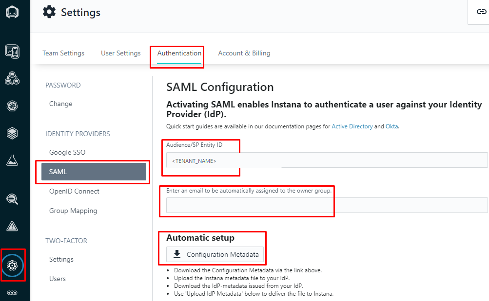
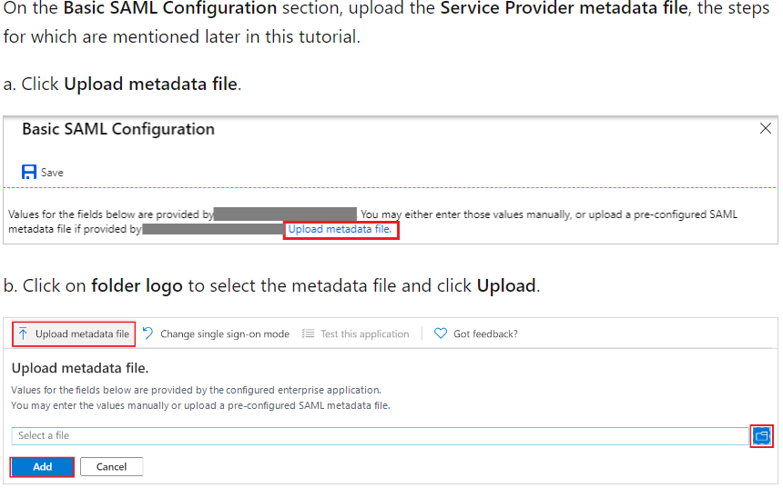
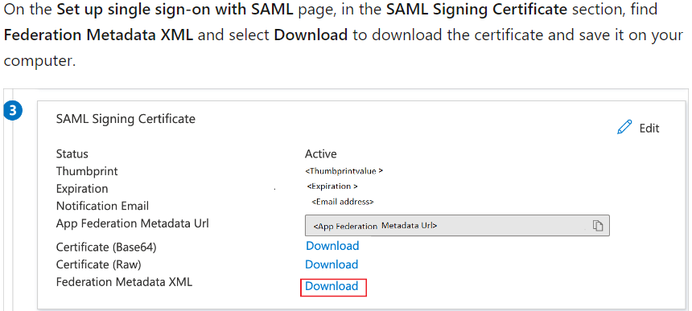
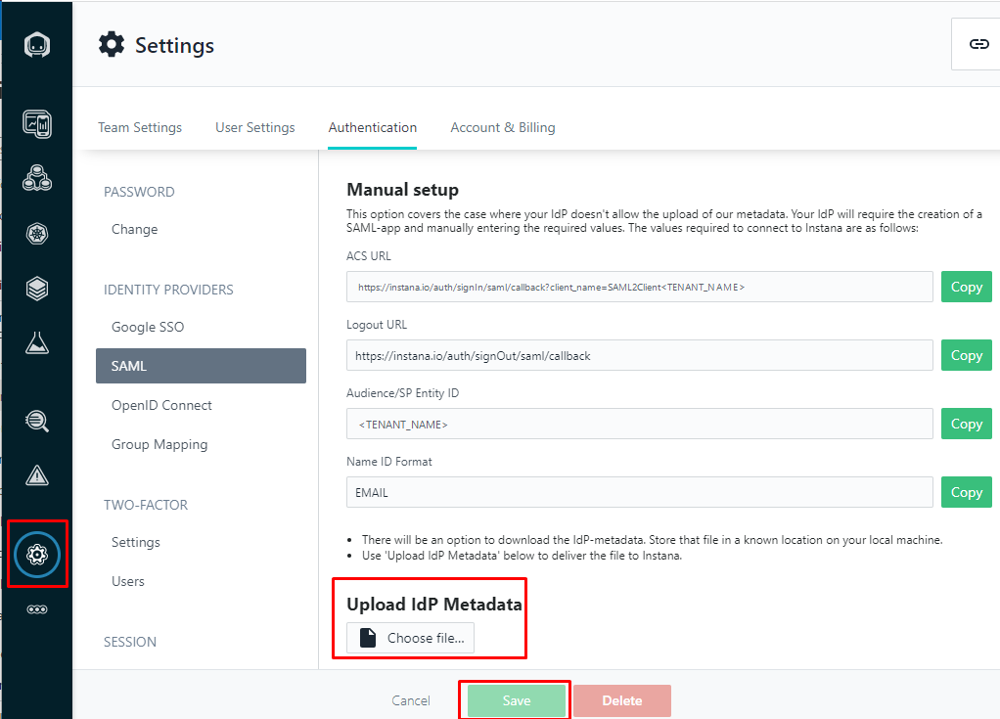
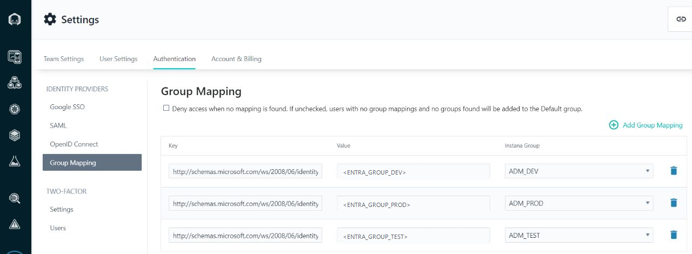

# Integración de IBM Instana con Microsoft Entra ID mediante SAML

Este procedimiento describe la integración de **IBM Instana** con **Microsoft Entra ID** mediante **SAML 2.0**, utilizando intercambio de metadata para habilitar Single Sign-On (SSO) y, opcionalmente, **IdP Role Mapping** para asignar roles de Instana a partir de atributos enviados por Microsoft Entra ID.

> **Nota de nomenclatura:** Microsoft Azure Active Directory (Azure AD) se denomina actualmente **Microsoft Entra ID**.
>
> **Nota sobre las capturas:** las imágenes de esta guía provienen de una versión anterior de las interfaces de Instana y Azure AD. Se mantienen como referencia visual, pero fueron **anonimizadas** y la navegación textual de este procedimiento se actualizó a la nomenclatura vigente.

---

## Objetivo

Configurar:

- **IBM Instana** como Service Provider (SP).
- **Microsoft Entra ID** como Identity Provider (IdP).
- Autenticación SSO mediante **SAML 2.0**.
- Opcionalmente, mapeo de atributos SAML hacia roles de Instana.

Flujo general:

```text
IBM Instana
   │
   │  1. Generar / descargar metadata del Service Provider
   ▼
Microsoft Entra ID
   │
   │  2. Crear aplicación empresarial SAML
   │  3. Importar metadata de Instana
   │  4. Configurar claims y asignar usuario/grupo de prueba
   │  5. Descargar Federation Metadata XML
   ▼
IBM Instana
   │
   │  6. Importar metadata del Identity Provider
   │  7. Validar autenticación SAML
   ▼
IdP Role Mapping
```

---

## Prerrequisitos

Antes de iniciar, confirme que dispone de:

- Acceso administrativo a IBM Instana.
- Permisos en Microsoft Entra ID para crear o modificar aplicaciones empresariales.
- Nombre del tenant de Instana que se utilizará como **Service Provider (SP) Entity ID**.
- Un usuario de Microsoft Entra ID para realizar la prueba.
- Roles de Instana previamente creados si se utilizará IdP Role Mapping.
- Acceso para descargar y transferir archivos XML de metadata SAML.

> **Importante:** una vez activado SAML para el tenant de Instana, el acceso al tenant se realiza mediante SAML. Mantenga abierta la sesión administrativa utilizada para realizar la configuración hasta validar correctamente el SSO desde una ventana de incógnito o un navegador diferente.

> **Self-Hosted:** si la instalación Self-Hosted no tiene configurado el Service Provider key/certificate requerido por SAML, revise previamente la configuración del Service Provider en la documentación oficial de IBM Instana.

---

## 1. Configurar SAML en IBM Instana

En la interfaz actual de Instana, navegue a:

```text
Settings
  └── Security & access
      └── Identity providers
          └── SAML
```

Complete:

- **Email ID / Admin-Owner account**.
- **Service Provider (SP) Entity ID**.

El **SP Entity ID corresponde al nombre del tenant de Instana**.

Seleccione la configuración:

```text
Automatic
```

y descargue la metadata de Instana mediante:

```text
Download Instana metadata
```

En versiones anteriores de la interfaz, esta opción aparecía como **Configuration Metadata**, como se observa en la siguiente captura.

> Los valores visibles en las capturas fueron anonimizados para permitir su publicación en un repositorio público.



### Resultado esperado

Debe disponer localmente del archivo XML de metadata generado por Instana.

---

## 2. Crear la aplicación empresarial en Microsoft Entra ID

Ingrese al **Microsoft Entra admin center** y navegue a:

```text
Entra ID
  └── Enterprise apps
      └── All applications
          └── New application
              └── Create your own application
```

Asigne un nombre descriptivo, por ejemplo:

```text
IBM Instana
```

Seleccione:

```text
Integrate any other application you don't find in the gallery (Non-gallery)
```

y cree la aplicación.

Luego navegue a:

```text
Enterprise application
  └── Single sign-on
      └── SAML
```

---

## 3. Subir metadata de Instana a Microsoft Entra ID

En la configuración SAML de la aplicación empresarial, ubique:

```text
Basic SAML Configuration
```

y utilice:

```text
Upload metadata file
```

Seleccione el archivo XML descargado desde Instana en el paso 1.



### Validación

Después de importar la metadata, revise que Microsoft Entra ID haya cargado los valores del Service Provider, principalmente:

- **Identifier (Entity ID)**.
- **Reply URL / Assertion Consumer Service (ACS) URL**.
- Otros valores incluidos en la metadata, cuando corresponda.

Si el IdP no permite importar metadata, utilice la configuración manual de Instana y copie los valores mostrados por Instana.

---

## 4. Configurar Attributes & Claims

En la aplicación empresarial de Microsoft Entra ID, revise:

```text
Single sign-on
  └── Attributes & Claims
```

Valide que el **Name ID** utilizado para el inicio de sesión sea compatible con la configuración de Instana.

IBM Instana requiere el formato SAML de Name ID:

```text
urn:oasis:names:tc:SAML:1.1:nameid-format:emailAddress
```

La fuente concreta del valor —por ejemplo, correo o UPN— debe definirse de acuerdo con la política de identidad del cliente y debe identificar correctamente al usuario.

Si posteriormente utilizará **IdP Role Mapping**, configure también los claims que Instana evaluará como:

```text
Key
Value
```

No utilice valores ficticios en producción: confirme los nombres y valores reales enviados dentro de la aserción SAML.

---

## 5. Asignar un usuario o grupo de prueba

En Microsoft Entra ID, abra:

```text
Enterprise applications
  └── IBM Instana
      └── Users and groups
          └── Add user/group
```

Asigne al menos un usuario de prueba.

Esta validación permite diferenciar un problema de SAML de un problema de asignación de acceso a la aplicación empresarial.

---

## 6. Descargar metadata desde Microsoft Entra ID

En la configuración SAML de la aplicación, ubique la sección:

```text
SAML Certificates
```

Descargue:

```text
Federation Metadata XML
```



### Resultado esperado

Debe disponer localmente del archivo XML de metadata generado por Microsoft Entra ID.

---

## 7. Subir metadata del IdP a IBM Instana

Regrese a:

```text
Settings
  └── Security & access
      └── Identity providers
          └── SAML
```

Seleccione:

```text
Choose file
```

y cargue el archivo **Federation Metadata XML** descargado desde Microsoft Entra ID.

En la interfaz anterior esta acción aparecía como:

```text
Upload IdP Metadata
```



Guarde la configuración.

### Valores de referencia para configuración manual

Si se utiliza configuración manual, Instana proporciona valores como:

```text
Service Provider (SP) Entity ID
<TENANT_NAME>
```

```text
Assertion Consumer Service (ACS) URL
https://instana.io/auth/signIn/saml/callback?client_name=SAML2Client<TENANT_NAME>
```

```text
Logout URL
https://instana.io/auth/signOut/saml/callback
```

Utilice siempre los valores generados o mostrados por su propio tenant.

---

## 8. Validar el inicio de sesión SAML

Antes de cerrar la sesión administrativa actual:

1. Abra una ventana de incógnito o un navegador diferente.
2. Acceda a la URL del tenant de Instana.
3. Inicie sesión con el usuario de prueba asignado en Microsoft Entra ID.
4. Confirme que Microsoft Entra ID autentica al usuario.
5. Confirme que el navegador regresa correctamente a Instana.
6. Verifique que el usuario aparece en Instana.

> No cierre la sesión administrativa original hasta completar esta prueba.

---

## 9. Configurar IdP Role Mapping

Si requiere asignar permisos de Instana en función de atributos o grupos enviados por Microsoft Entra ID, navegue a:

```text
Settings
  └── Security & access
      └── Identity providers
          └── Role mapping
```

Cree una regla de mapeo.

Los campos principales son:

| Campo | Descripción |
|---|---|
| **Key** | Nombre exacto del atributo SAML recibido desde Microsoft Entra ID. |
| **Value** | Valor exacto del atributo que debe coincidir con la regla. |
| **Role** | Rol de Instana que se asignará al usuario. |
| **Team** | Opcional, si se requiere asociar al usuario con un equipo. |

Ejemplo conceptual:

```text
Key                  Value                 Role
------------------   -------------------   --------------
<SAML_CLAIM_KEY>     <ENTRA_GROUP_DEV>     ADM_DEV
<SAML_CLAIM_KEY>     <ENTRA_GROUP_PROD>    ADM_PROD
<SAML_CLAIM_KEY>     <ENTRA_GROUP_TEST>    ADM_TEST
```

La siguiente captura corresponde a una interfaz anterior denominada **Group Mapping**. En las versiones actuales, la funcionalidad se presenta como **IdP Role Mapping / Role mapping**.



### `Deny access when no mapping is found`

Durante la implementación y las pruebas iniciales, puede mantenerse esta opción **deshabilitada** para evitar bloquear usuarios mientras se validan las reglas.

Cuando las reglas hayan sido probadas, el cliente puede habilitarla si su política requiere impedir el acceso a usuarios que no coincidan con ningún mapping.

Si la opción permanece deshabilitada y no existe una coincidencia, el comportamiento de acceso dependerá del rol `default` configurado en Instana.

### Consideraciones del mapping

- `Key` y `Value` deben coincidir exactamente con los valores recibidos en la aserción SAML.
- Los valores son sensibles a mayúsculas/minúsculas.
- Un usuario puede recibir más de un rol cuando coincida con varias reglas.
- Los cambios de atributos o grupos se reflejan al volver a iniciar sesión.
- Valide el resultado en:

```text
Settings
  └── Security & access
      └── Users
```

---

## 10. Validación final

Confirme:

```text
[ ] Aplicación empresarial creada en Microsoft Entra ID
[ ] SAML habilitado para la aplicación
[ ] Metadata de Instana importada en Entra ID
[ ] Attributes & Claims revisados
[ ] Usuario/grupo de prueba asignado
[ ] Federation Metadata XML descargado
[ ] Metadata de Entra ID importada en Instana
[ ] Inicio de sesión SAML probado en incógnito
[ ] Usuario visible en Instana
[ ] Role Mapping validado, si aplica
```

---

## 11. Operación y mantenimiento

### Certificado SAML

Microsoft Entra ID utiliza certificados de firma para SAML. Estos certificados tienen ciclo de vida y deben renovarse antes de expirar.

Revise periódicamente:

```text
Entra ID
  └── Enterprise apps
      └── IBM Instana
          └── Single sign-on
              └── SAML Certificates
```

Planifique la rotación antes del vencimiento para evitar interrupciones del SSO.

### Cambios en la configuración de Instana

La configuración SAML activa debe tratarse como un cambio controlado.

Antes de modificarla:

- Mantenga una sesión administrativa disponible.
- Documente la configuración actual.
- Pruebe el nuevo flujo con un usuario controlado.
- Tenga presente que cambios de la configuración SAML activa pueden requerir eliminarla y crearla nuevamente.

### Protección de información

No publique en el repositorio:

- Metadata XML real de clientes.
- Certificados privados.
- Tokens o secretos.
- Dominios internos.
- Identificadores de tenant de clientes.
- Correos reales.
- Nombres de clientes o grupos corporativos reales.

---

## Referencias oficiales

- IBM Instana Observability — Configuring authentication:  
  https://www.ibm.com/docs/en/instana-observability?topic=instana-configuring-authentication

- IBM Instana Observability — IdP Role Mapping:  
  https://www.ibm.com/docs/en/instana-observability?topic=authentication-idp-role-mapping

- Microsoft Entra ID — Enable SAML single sign-on for an enterprise application:  
  https://learn.microsoft.com/en-us/entra/identity/enterprise-apps/add-application-portal-setup-sso

- Microsoft Entra ID — Federation certificate management:  
  https://learn.microsoft.com/en-us/entra/identity/enterprise-apps/tutorial-manage-certificates-for-federated-single-sign-on

---

## Fuente del procedimiento

Guía adaptada a partir del documento **“Instana Integracion con Azure AD”**, conservando su flujo funcional y las capturas de referencia, pero:

- actualizando la nomenclatura **Azure AD → Microsoft Entra ID**;
- alineando la navegación con la interfaz actual documentada por IBM Instana;
- incorporando creación de la aplicación empresarial, claims y asignación de usuario de prueba;
- actualizando **Group Mapping → IdP Role Mapping**;
- incorporando consideraciones operativas sobre acceso SAML y renovación de certificados;
- anonimizando datos de clientes y ambientes antes de su publicación.
