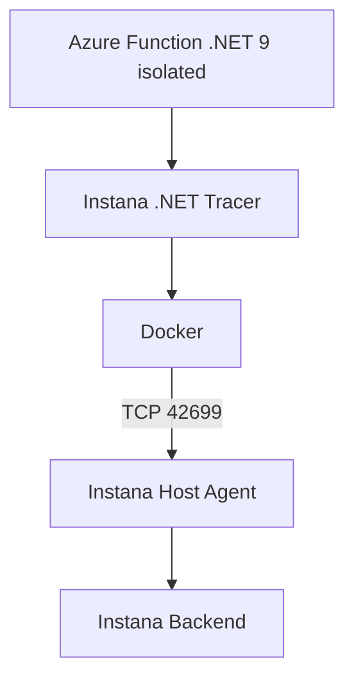

# IBM Instana + Azure Functions .NET 9 Lab

Laboratorio reproducible para investigar compatibilidad y estabilidad de la instrumentación IBM Instana en Azure Functions .NET 9 isolated ejecutada en Docker.

## Objetivo

Separar experimentalmente la imagen base, el runtime .NET, el worker isolated, el tracer nativo y la comunicación con el Host Agent. El repositorio conserva resultados, scripts y evidencia seleccionada; no contiene credenciales.

## Caso de estudio

El caso original fue una Azure Function .NET 9 isolated que dejó de iniciar después de habilitar instrumentación automática en un orquestador y terminó con `ExitCode 139`. El laboratorio local buscó reproducir el comportamiento primero en Docker, eliminando las variables de Kubernetes y del webhook.

## Arquitectura del laboratorio



## Imagen evaluada

La imagen final se mantuvo en:

```text
mcr.microsoft.com/azure-functions/dotnet-isolated:4-dotnet-isolated9.0
```

Durante el laboratorio, ese tag mutable resolvió a Debian 12 y glibc 2.36. El ambiente original observado había usado Debian 11 y glibc 2.31. La igualdad del tag no demuestra igualdad del digest ni reproduce exactamente el filesystem histórico.

## Qué se validó

| Test | Sin Instana | Con Instana manual 1.321.2 | Resultado |
|---|---|---|---|
| Baseline: sólo `/api/health` | Estable | Estable | Instrumentación mínima funcional |
| Segunda Function: `/api/test` | Estable | Inestable en idle | Reinicio del worker sin tráfico |
| Escenario ampliado | Estable | Inestable en idle | Misma clase de reinicio |

Además, `CoreProfiler.so` cargó con sus dependencias nativas resueltas y el contenedor alcanzó al Host Agent 1.322.0 por TCP 42699.

## Resultado principal

El baseline de una Function se mantuvo estable con instrumentación manual. Al agregar una segunda Azure Function HTTP mínima, la variante clean continuó estable, pero la variante instrumentada reinició el worker isolated incluso sin recibir tráfico; Functions Host alcanzó su límite de reinicios. No hubo OOM y no se observó `ExitCode 139` en el contenedor.

## Conclusión

La instrumentación .NET 9 sobre la imagen actual fue validada en un escenario mínimo. También se identificó una inestabilidad reproducible al aumentar de una a dos Azure Functions dentro del mismo worker isolated. El `ExitCode 139` exacto del ambiente original no fue reproducido y requiere el digest original Debian 11/glibc 2.31 y la instrumentación AutoTrace exacta.

Estos resultados no permiten declarar incompatible la imagen Microsoft ni constituyen un análisis de causa raíz.

## Cómo reproducir el baseline Docker

Requisitos: Linux, Git, Docker con BuildKit, `curl` y acceso a un Instana Host Agent autorizado en TCP 42699.

```bash
git clone <URL>
cd instana-dotnet9-functions-lab
cp .env.example .env
./scripts/02-build-clean.sh
./scripts/03-run-clean.sh
```

Para la variante instrumentada, el Dockerfile fija el tracer usado en el estudio. No coloque secretos en el repositorio:

```bash
docker build --progress=plain \
  -f docker/Dockerfile.instana \
  -t instana-dotnet9-lab:instana .
./scripts/07-run-instana.sh
docker logs instana-dotnet9-manual
```

El script publica un puerto local aleatorio. Puede consultarse con:

```bash
docker port instana-dotnet9-manual 80/tcp
curl http://127.0.0.1:<PUERTO>/api/health
```

Los scripts de ejecución crean contenedores con nombres fijos; elimine únicamente esos contenedores antes de repetir una corrida. No ejecute los scripts de matriz si sólo desea reproducir el baseline.

## Documentación

- [Contexto y alcance](docs/01-contexto.md)
- [Arquitectura](docs/02-arquitectura.md)
- [Laboratorio Docker](docs/03-laboratorio-docker.md)
- [Matriz de pruebas](docs/04-matriz-pruebas.md)
- [Resultados](docs/05-resultados.md)
- [Conclusiones](docs/06-conclusiones.md)
- [Siguiente investigación](docs/07-siguiente-investigacion.md)
- [Troubleshooting](docs/08-troubleshooting.md)
- [Resumen ejecutivo](docs/RESUMEN-EJECUTIVO.md)
- [Fuentes oficiales](docs/FUENTES.md)
- [Índice de evidencias](evidencias/README.md)
