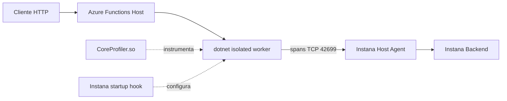
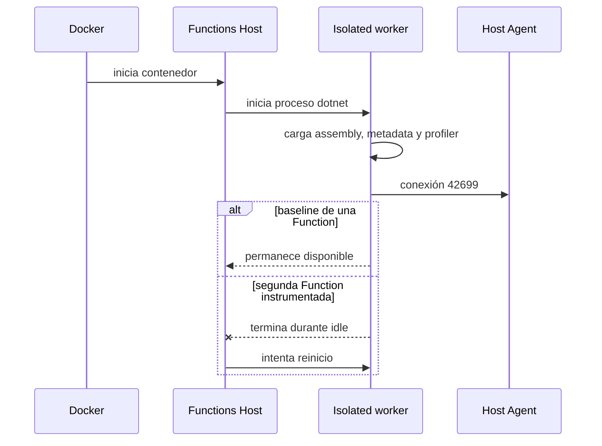

# Arquitectura

Azure Functions isolated separa el Functions Host del proceso de aplicación. El Host descubre las Functions, administra invocaciones y supervisa al worker. El worker ejecuta el assembly .NET del laboratorio.

## Componentes

- **Functions Host:** proceso padre que inicia y reinicia el worker isolated. El estado del contenedor por sí solo no describe siempre cómo terminó el child.
- **Isolated worker:** proceso `dotnet` que carga el assembly de la aplicación y sus metadatos de Functions.
- **Instana tracer:** paquetes .NET incorporados durante el build instrumentado.
- **CoreProfiler:** biblioteca nativa cargada mediante las variables CLR documentadas por IBM. En la combinación probada, `ldd` no reportó dependencias faltantes.
- **Host Agent:** receptor local de telemetría. El contenedor lo alcanzó mediante `host.docker.internal` y `host-gateway`, no mediante su propio `localhost`.
- **Backend:** destino del Host Agent. La visibilidad completa en UI no fue demostrada en esta etapa y no se usa como prueba de estabilidad.

## Flujo de inicio relevante

