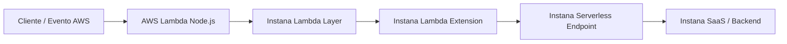

# Instrumentación de AWS Lambda Node.js con IBM Instana

## 1. Objetivo

El objetivo de este documento es detallar el procedimiento para instrumentar funciones **AWS Lambda desarrolladas en Node.js** con **IBM Instana**, permitiendo obtener trazabilidad, visibilidad de invocaciones, errores, duración, dependencias y correlación con otros componentes monitoreados por Instana.

Este procedimiento se basa en la documentación pública latest de IBM Instana para **AWS Lambda Native Tracing for Node.js**.

Referencia oficial IBM Instana:

```text
https://www.ibm.com/docs/en/instana-observability?topic=lambda-aws-native-tracing-nodejs
```

---

## 2. Alcance

Este documento cubre la instrumentación de AWS Lambda Node.js mediante los siguientes enfoques:

| Método | Descripción | Uso recomendado |
|---|---|---|
| Instana AutoTrace con Lambda Layer | Instrumentación sin modificar el código de la función | Método recomendado |
| Instalación manual con `@instana/aws-lambda` | Instrumentación modificando el código de la función | Ambientes restringidos o casos especiales |
| Lambda basada en contenedor | Inclusión de componentes Instana en Dockerfile | Cuando la Lambda se despliega como imagen |
| Serverless Framework | Configuración desde `serverless.yml` | Cuando el despliegue se administra con Serverless Framework |

Para un cliente que requiere una implementación clara, rápida y mantenible, se recomienda iniciar con **Instana AutoTrace usando Lambda Layer**.

---

## 3. Consideraciones importantes

Antes de implementar, considerar lo siguiente:

1. Instana permite instrumentar Lambdas Node.js usando un **Lambda Layer** y un **handler de auto-wrap**.
2. El método AutoTrace no requiere modificar el código de la función.
3. El handler original de la Lambda debe conservarse en la variable `LAMBDA_HANDLER`, cuando no sea el valor por defecto.
4. El endpoint de Instana para serverless debe iniciar con:

```text
https://serverless-
```

5. El valor de `INSTANA_AGENT_KEY` corresponde al Agent Key del tenant Instana.
6. La función Lambda debe tener salida hacia el endpoint serverless de Instana.
7. IBM recomienda usar las versiones latest del Lambda Layer y actualizarlas periódicamente para recibir mejoras y fixes.
8. El AWS Agent para Lambda monitoring es complementario, ya que permite obtener información de versiones y algunas métricas runtime que no pueden capturarse desde dentro del runtime de Lambda.
9. Para GovCloud, IBM indica que no ofrece Lambda Layers, por lo que en ese caso se debe usar instalación manual del paquete `@instana/aws-lambda`.
10. El Lambda extension incluido en la capa Node.js trabaja mejor con funciones configuradas con **256 MB de memoria o más**.

---

## 4. Runtimes soportados

De acuerdo con la documentación pública latest de IBM Instana, los runtimes soportados para AWS Lambda Node.js son:

| Runtime |
|---|
| Node.js 24.x |
| Node.js 22.x |
| Node.js 20.x |
| Node.js 18.x |

Si el cliente usa una versión anterior de Node.js, se debe revisar la documentación de versiones anteriores de Instana y evaluar actualización del runtime.

---

## 5. Arquitectura de referencia



En este flujo:

- La función Lambda recibe una invocación.
- El handler de Instana envuelve el handler real de la función.
- La capa de Instana captura trazas y métricas.
- La extensión local envía la información hacia el endpoint serverless de Instana.

---

## 6. Prerrequisitos

### 6.1 Prerrequisitos en Instana

Se debe contar con:

- Tenant Instana SaaS o Self-hosted disponible.
- Agent Key de Instana.
- Serverless monitoring endpoint.
- Acceso a la consola de Instana.
- Permisos para acceder a la sección de instalación de agentes.

Ruta referencial en Instana:

```text
More > Agents > Installing Instana Agents > Platform: AWS > Technology: AWS Lambda
```

Desde esta sección se puede obtener:

- `INSTANA_ENDPOINT_URL`
- `INSTANA_AGENT_KEY`
- Información de configuración para AWS Lambda.

---

### 6.2 Prerrequisitos en AWS

Se debe contar con:

- Acceso a la consola de AWS Lambda.
- Permisos para modificar la función Lambda.
- Permisos para agregar Layers.
- Permisos para editar Runtime settings.
- Permisos para configurar variables de entorno.
- AWS CLI instalada, si se desea automatizar.
- Conectividad saliente desde Lambda hacia el endpoint serverless de Instana.

---

### 6.3 Prerrequisito recomendado: AWS Agent para Lambda monitoring

IBM recomienda configurar el AWS Agent para Lambda monitoring cuando se requiere recolectar información complementaria, como versiones y algunas métricas runtime que no se pueden obtener desde dentro del runtime de Lambda.

Este punto no reemplaza la instrumentación de la función. Son dos capas complementarias:

| Componente | Función |
|---|---|
| AWS Agent / AWS Sensor | Descubre Lambda desde AWS APIs y CloudWatch |
| Instana Lambda Layer / Tracer | Instrumenta la ejecución interna de la función |

---

## 7. Método recomendado: AutoTrace con Instana Lambda Layer

Este es el método recomendado para instrumentar Lambda Node.js porque no requiere modificar el código fuente.

### 7.1 Flujo general

```text
1. Identificar runtime y arquitectura de la Lambda.
2. Obtener el ARN del Lambda Layer de Instana para la región correspondiente.
3. Agregar el Layer a la función Lambda.
4. Cambiar el handler de la función por el handler de Instana.
5. Configurar variables de entorno.
6. Guardar cambios.
7. Invocar la función.
8. Validar trazas y métricas en Instana.
```

---

## 8. Paso 1: Identificar runtime, región y arquitectura

Antes de seleccionar el layer, validar:

| Parámetro | Ejemplo |
|---|---|
| Región AWS | `us-east-1` |
| Runtime | `nodejs20.x` |
| Arquitectura | `x86_64` o `arm64` |
| Handler actual | `index.handler` |
| Tipo de módulo | CommonJS o ES Modules |

Ejemplo AWS CLI:

```bash
aws lambda get-function-configuration \
  --function-name <LAMBDA_FUNCTION_NAME> \
  --region <AWS_REGION> \
  --query '{Runtime:Runtime,Architectures:Architectures,Handler:Handler,MemorySize:MemorySize,Timeout:Timeout}'
```

---

## 9. Paso 2: Obtener el ARN del Lambda Layer de Instana

La documentación de IBM publica los ARNs latest por región y arquitectura.

Patrón para arquitectura `x86_64` fuera de China:

```text
arn:aws:lambda:${region}:410797082306:layer:instana-nodejs:${layer-version}
```

Patrón para arquitectura `arm64` fuera de China:

```text
arn:aws:lambda:${region}:410797082306:layer:instana-nodejs-arm64:${layer-version}
```

Para China, el patrón usa otro account ID:

```text
arn:aws-cn:lambda:${region}:107998019096:layer:instana-nodejs:${layer-version}
```

Ejemplos latest indicados por IBM para regiones comunes:

| Región | Arquitectura | ARN |
|---|---|---|
| `us-east-1` | x86_64 | `arn:aws:lambda:us-east-1:410797082306:layer:instana-nodejs:294` |
| `us-east-2` | x86_64 | `arn:aws:lambda:us-east-2:410797082306:layer:instana-nodejs:294` |
| `us-west-2` | x86_64 | `arn:aws:lambda:us-west-2:410797082306:layer:instana-nodejs:294` |
| `sa-east-1` | x86_64 | `arn:aws:lambda:sa-east-1:410797082306:layer:instana-nodejs:294` |
| `us-east-1` | arm64 | `arn:aws:lambda:us-east-1:410797082306:layer:instana-nodejs-arm64:175` |
| `us-east-2` | arm64 | `arn:aws:lambda:us-east-2:410797082306:layer:instana-nodejs-arm64:175` |
| `us-west-2` | arm64 | `arn:aws:lambda:us-west-2:410797082306:layer:instana-nodejs-arm64:175` |
| `sa-east-1` | arm64 | `arn:aws:lambda:sa-east-1:410797082306:layer:instana-nodejs-arm64:175` |

> Nota: Validar siempre la tabla latest de IBM antes de implementar en cliente, ya que los números de versión del layer pueden cambiar.

Referencia oficial:

```text
https://www.ibm.com/docs/en/instana-observability?topic=lambda-aws-native-tracing-nodejs
```

---

## 10. Paso 3: Agregar el Lambda Layer

Desde AWS Console:

1. Ingresar a AWS Lambda.
2. Seleccionar la función Node.js.
3. Ir a la sección **Layers**.
4. Seleccionar **Add a layer**.
5. Seleccionar **Specify an ARN**.
6. Pegar el ARN del layer de Instana correspondiente a la región y arquitectura.
7. Validar que AWS reconozca el layer.
8. Guardar los cambios.

Proceso oficial mostrado por IBM en su documentación:

```text
Function > Layers > Add a layer > Specify an ARN > Add
```

Capturas/proceso de referencia de IBM:

| Captura IBM | Acción representada |
|---|---|
| Layer | Seleccionar la sección de Layers en la Lambda |
| Layer selection | Agregar layer indicando el ARN |

---

## 11. Paso 4: Configurar el handler de Instana

La función Lambda debe dejar de apuntar directamente al handler original y debe apuntar al handler de Instana.

### 11.1 Para CommonJS

Usar:

```text
instana-aws-lambda-auto-wrap.handler
```

### 11.2 Para ES Modules

Usar:

```text
instana-aws-lambda-auto-wrap-esm.handler
```

> El handler para ES Modules está disponible desde layer version 223, según IBM.

### 11.3 Cambio desde AWS Console

1. Ir a la función Lambda.
2. Ir a **Runtime settings**.
3. Seleccionar **Edit**.
4. Cambiar el campo **Handler**.
5. Guardar.

Proceso oficial mostrado por IBM:

```text
Function > Runtime settings > Edit > Handler > Save
```

Capturas/proceso de referencia de IBM:

| Captura IBM | Acción representada |
|---|---|
| Basic settings section edit button | Editar configuración del runtime |
| Edit basic settings to set Instana handler | Cambiar handler por el handler de Instana |

---

## 12. Paso 5: Configurar variables de entorno

Agregar las siguientes variables en la función Lambda:

| Variable | Obligatoria | Descripción | Ejemplo |
|---|---|---|---|
| `INSTANA_ENDPOINT_URL` | Sí | Endpoint serverless de Instana | `https://serverless-<region>.instana.io` |
| `INSTANA_AGENT_KEY` | Sí | Agent Key del tenant Instana | `<agent_key>` |
| `LAMBDA_HANDLER` | Depende | Handler original de la función | `index.handler` |

### 12.1 Caso con handler por defecto

Si el handler original era:

```text
index.handler
```

IBM indica que no es necesario configurar `LAMBDA_HANDLER`, porque ese es el valor por defecto usado por la capa de Instana.

### 12.2 Caso con handler personalizado

Si el handler original era:

```text
server.handler
```

Entonces configurar:

```text
LAMBDA_HANDLER=server.handler
```

### 12.3 Ejemplo de variables

```text
INSTANA_ENDPOINT_URL=https://serverless-<REGION>.instana.io
INSTANA_AGENT_KEY=<INSTANA_AGENT_KEY>
LAMBDA_HANDLER=index.handler
```

> Recomendación: En ambientes productivos, evaluar el uso de AWS Secrets Manager o SSM Parameter Store para evitar exponer el Agent Key en texto plano. Para Node.js, IBM también documenta soporte de SSM para el Agent Key.

---

## 13. Paso 6: Guardar e invocar la función

Luego de agregar el layer, cambiar el handler y configurar variables:

1. Guardar los cambios de la Lambda.
2. Ejecutar una invocación de prueba.
3. Validar respuesta funcional de la aplicación.
4. Revisar logs en CloudWatch Logs.
5. Validar que la función aparezca en Instana.

Ejemplo de invocación con AWS CLI:

```bash
aws lambda invoke \
  --function-name <LAMBDA_FUNCTION_NAME> \
  --region <AWS_REGION> \
  --payload '{}' \
  response.json
```

Ver respuesta:

```bash
cat response.json
```

---

## 14. Automatización con AWS CLI

IBM publica un ejemplo de automatización con AWS CLI, pero advierte que no debe copiarse literalmente porque puede sobrescribir layers y variables existentes.

Ejemplo adaptado:

```bash
aws lambda update-function-configuration \
  --region <AWS_REGION> \
  --function-name <LAMBDA_FUNCTION_NAME> \
  --layers <INSTANA_LAYER_ARN> \
  --handler instana-aws-lambda-auto-wrap.handler \
  --environment "Variables={INSTANA_ENDPOINT_URL=<INSTANA_ENDPOINT_URL>,INSTANA_AGENT_KEY=<INSTANA_AGENT_KEY>,LAMBDA_HANDLER=<ORIGINAL_HANDLER>}"
```

> Importante: Si la función ya tiene otros layers o variables, primero obtener la configuración actual y luego agregar Instana sin eliminar lo existente.

Validar layers actuales:

```bash
aws lambda get-function-configuration \
  --function-name <LAMBDA_FUNCTION_NAME> \
  --region <AWS_REGION> \
  --query 'Layers'
```

Validar variables actuales:

```bash
aws lambda get-function-configuration \
  --function-name <LAMBDA_FUNCTION_NAME> \
  --region <AWS_REGION> \
  --query 'Environment.Variables'
```

---

## 15. Instalación manual con `@instana/aws-lambda`

Usar este método solo si no se puede usar AutoTrace con Lambda Layer.

Casos donde puede aplicar:

- Ambientes restringidos.
- GovCloud.
- Restricciones internas sobre uso de layers externos.
- Necesidad de control directo sobre dependencias.

### 15.1 Instalar paquete

```bash
npm install --save @instana/aws-lambda@latest
```

### 15.2 Modificar código del handler

#### Antes

```javascript
exports.handler = async (event, context) => {
  // lógica de la función
};
```

#### Después

```javascript
const instana = require('@instana/aws-lambda');

exports.handler = instana.wrap(async (event, context) => {
  // lógica de la función
});
```

### 15.3 Callback style

```javascript
const instana = require('@instana/aws-lambda');

exports.handler = instana.wrap((event, context, callback) => {
  // lógica de la función
});
```

### 15.4 Variables requeridas

```text
INSTANA_ENDPOINT_URL=<SERVERLESS_ENDPOINT>
INSTANA_AGENT_KEY=<AGENT_KEY>
```

---

## 16. Lambda basada en contenedor

Si la Lambda se despliega como imagen, IBM indica que se pueden usar los componentes de Instana desde:

```text
icr.io/instana/aws-lambda-nodejs
```

Ejemplo referencial de Dockerfile:

```dockerfile
FROM icr.io/instana/aws-lambda-nodejs:latest as instana-layer

FROM public.ecr.aws/lambda/nodejs:22

COPY --from=instana-layer /opt/extensions/ /opt/extensions/
COPY --from=instana-layer /opt/nodejs/ /opt/nodejs/

COPY index.js package.json package-lock.json /var/task/
WORKDIR /var/task
RUN npm install

CMD [ "instana-aws-lambda-auto-wrap.handler" ]
```

Para ES Modules:

```dockerfile
CMD [ "instana-aws-lambda-auto-wrap-esm.handler" ]
```

> Nota: IBM indica que esta opción soporta actualmente arquitectura `x86_64`.

---

## 17. Serverless Framework

Si la función se despliega con Serverless Framework, agregar el layer, handler y variables en `serverless.yml`.

Ejemplo referencial actualizado:

```yaml
service: lambda-nodejs-instana

provider:
  name: aws
  runtime: nodejs20.x
  stage: dev
  region: us-east-1

functions:
  api:
    handler: instana-aws-lambda-auto-wrap.handler
    environment:
      INSTANA_ENDPOINT_URL: ${env:INSTANA_ENDPOINT_URL}
      INSTANA_AGENT_KEY: ${env:INSTANA_AGENT_KEY}
      LAMBDA_HANDLER: src/index.handler
    layers:
      - arn:aws:lambda:us-east-1:410797082306:layer:instana-nodejs:294
```

> Recomendación: No colocar el Agent Key directamente en el repositorio. Usar variables de entorno, SSM Parameter Store, Secrets Manager o el mecanismo aprobado por el cliente.

---

## 18. Uso de SSM Parameter Store para Agent Key

IBM documenta que se puede entregar el Agent Key usando AWS Systems Manager Parameter Store.

Flujo:

1. Crear un parámetro en SSM con el Agent Key.
2. Remover `INSTANA_AGENT_KEY` de las variables de entorno.
3. Agregar:

```text
INSTANA_SSM_PARAM_NAME=<NOMBRE_PARAMETRO_SSM>
```

4. Si el parámetro es `SecureString`, agregar:

```text
INSTANA_SSM_DECRYPTION=true
```

Consideración importante:

- Si `INSTANA_AGENT_KEY` sigue definido, IBM indica que las variables de SSM serán ignoradas.
- Para funciones de muy corta duración, puede ser preferible usar `INSTANA_AGENT_KEY` directamente, ya que la lectura desde SSM podría no completarse antes de que la función termine.

---

## 19. Variables adicionales útiles

| Variable | Valor por defecto | Uso |
|---|---|---|
| `INSTANA_DISABLE_LAMBDA_EXTENSION` | `false` | Deshabilita la Lambda extension si se define con cualquier valor no vacío |
| `INSTANA_ENABLE_LAMBDA_TIMEOUT_DETECTION` | `false` | Habilita detección de timeout para troubleshooting |
| `INSTANA_MINIMUM_LAMBDA_TIMEOUT_FOR_TIMEOUT_DETECTION_IN_MS` | `2000` | Define timeout mínimo para detección |
| `INSTANA_DEBUG` | `false` | Habilita logs de debug |
| `INSTANA_TIMEOUT` | `1000` | Timeout en ms para envío hacia Instana |

Usar `INSTANA_DEBUG=true` únicamente durante troubleshooting, no como configuración permanente de producción.

---

## 20. Validación en AWS

### 20.1 Validar configuración

```bash
aws lambda get-function-configuration \
  --function-name <LAMBDA_FUNCTION_NAME> \
  --region <AWS_REGION> \
  --query '{Runtime:Runtime,Handler:Handler,Layers:Layers,Environment:Environment}'
```

Validar:

- Runtime Node.js soportado.
- Handler de Instana configurado.
- Layer de Instana agregado.
- Variables `INSTANA_ENDPOINT_URL` y `INSTANA_AGENT_KEY` configuradas.
- Variable `LAMBDA_HANDLER`, si el handler original no es `index.handler`.

---

### 20.2 Validar logs en CloudWatch

```bash
aws logs describe-log-groups \
  --log-group-name-prefix /aws/lambda/<LAMBDA_FUNCTION_NAME> \
  --region <AWS_REGION>
```

Revisar eventos:

```bash
aws logs tail /aws/lambda/<LAMBDA_FUNCTION_NAME> \
  --region <AWS_REGION> \
  --follow
```

Buscar errores como:

```text
Cannot find module
Access denied
timeout
INSTANA_AGENT_KEY
INSTANA_ENDPOINT_URL
```

---

## 21. Validación en Instana

Luego de invocar la Lambda, validar en Instana:

1. La función Lambda aparece como entidad monitoreada.
2. Se observan invocaciones.
3. Se visualizan trazas.
4. Se muestran errores, si la función retorna error.
5. Se observan dependencias salientes, por ejemplo llamadas HTTP, DynamoDB, S3 u otros servicios.
6. Se correlaciona con otros servicios monitoreados, si existen.
7. La latencia y duración son coherentes con las invocaciones realizadas.

---

## 22. Troubleshooting

| Síntoma | Posible causa | Acción recomendada |
|---|---|---|
| No aparecen trazas en Instana | No se configuró `INSTANA_ENDPOINT_URL` o `INSTANA_AGENT_KEY` | Validar variables de entorno |
| Error de handler | Handler de Instana mal configurado | Usar `instana-aws-lambda-auto-wrap.handler` para CommonJS o `instana-aws-lambda-auto-wrap-esm.handler` para ES Modules |
| Lambda no encuentra el handler original | Falta `LAMBDA_HANDLER` | Configurar el handler original, por ejemplo `server.handler` |
| AWS Console muestra advertencia de archivo no encontrado | AWS no detecta archivos dentro del layer | IBM indica que esta advertencia puede ignorarse si el layer está correctamente agregado |
| No hay salida hacia Instana | Lambda en VPC sin NAT/proxy | Validar conectividad hacia endpoint serverless |
| Función falla después del cambio | Se reemplazaron variables o layers existentes | Restaurar configuración previa y agregar Instana sin eliminar lo existente |
| No funciona en GovCloud | No hay Lambda Layers de Instana para GovCloud | Usar instalación manual con `@instana/aws-lambda` |
| Poca visibilidad de versiones/métricas runtime | Falta AWS Agent para Lambda monitoring | Configurar AWS Agent / AWS Sensor para Lambda |
| Overhead o comportamiento extraño | Lambda extension activa en función muy pequeña | Validar memoria mínima de 256 MB o evaluar `INSTANA_DISABLE_LAMBDA_EXTENSION` |

---

## 23. Checklist de implementación

- [ ] Confirmar región AWS.
- [ ] Confirmar runtime Node.js.
- [ ] Confirmar arquitectura `x86_64` o `arm64`.
- [ ] Confirmar handler original.
- [ ] Obtener endpoint serverless de Instana.
- [ ] Obtener Agent Key de Instana.
- [ ] Obtener ARN latest del Lambda Layer desde IBM.
- [ ] Agregar layer a la Lambda.
- [ ] Cambiar handler a Instana.
- [ ] Configurar variables de entorno.
- [ ] Invocar la función.
- [ ] Revisar logs CloudWatch.
- [ ] Validar trazas en Instana.
- [ ] Documentar cambios aplicados.

---

## 24. Referencias oficiales

- IBM Instana - AWS Lambda Native Tracing for Node.js  
  https://www.ibm.com/docs/en/instana-observability?topic=lambda-aws-native-tracing-nodejs

- IBM Instana - Installing and configuring serverless agents  
  https://www.ibm.com/docs/en/instana-observability?topic=agents-installing-configuring-serverless

- IBM Instana - AWS Agent for AWS/CloudWatch  
  https://www.ibm.com/docs/en/instana-observability?topic=agents-amazon-web-services-aws
