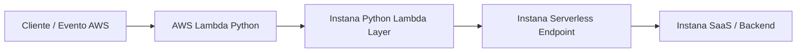

# Instrumentación de AWS Lambda Python con IBM Instana

## 1. Objetivo

El objetivo de este documento es detallar el procedimiento para instrumentar funciones **AWS Lambda desarrolladas en Python** con **IBM Instana**, permitiendo obtener trazabilidad, visibilidad de invocaciones, errores, duración y dependencias de la función.

Este procedimiento se basa en la documentación pública latest de IBM Instana para **AWS Lambda Native Tracing for Python**.

Referencia oficial IBM Instana:

```text
https://www.ibm.com/docs/en/instana-observability?topic=lambda-aws-native-tracing-python
```

---

## 2. Alcance

Este documento cubre la instrumentación de AWS Lambda Python mediante los siguientes enfoques:

| Método | Descripción | Uso recomendado |
|---|---|---|
| Instana Lambda Layer | Instrumentación sin modificar el código de la función | Método recomendado |
| Instalación manual del paquete `instana` | Instrumentación agregando dependencia al proyecto | Ambientes restringidos o casos especiales |

Para una implementación estándar en cliente, se recomienda iniciar con **Instana Lambda Layer**, ya que permite instrumentar la Lambda por configuración.

---

## 3. Consideraciones importantes

Antes de implementar, considerar lo siguiente:

1. IBM recomienda usar el **Instana Lambda Layer** como método preferido para Python.
2. El handler de la Lambda debe cambiarse a:

```text
instana.lambda_handler
```

3. El handler original debe informarse mediante la variable `LAMBDA_HANDLER`, cuando no se usa el valor por defecto.
4. El endpoint de Instana para serverless debe iniciar con:

```text
https://serverless-
```

5. La función Lambda debe tener salida hacia el endpoint serverless de Instana.
6. El AWS Agent para Lambda monitoring es complementario, ya que permite obtener versiones y algunas métricas runtime que no pueden capturarse desde dentro del runtime de Lambda.
7. Si la función Python tiene múltiples layers, IBM indica que el orden de layers puede afectar el rendimiento de la capa de Instana.
8. Para asegurar el correcto tracing, IBM recomienda colocar el layer de Instana en la última posición del orden de merge de layers.
9. IBM indica que Python 3.8 ya no recibe parches ni soporte técnico en AWS Lambda desde el 14 de octubre de 2024.
10. Se debe validar siempre la versión latest del Lambda Layer antes de implementar.

---

## 4. Runtimes soportados

De acuerdo con la documentación pública latest de IBM Instana, los runtimes soportados para AWS Lambda Python son:

| Runtime |
|---|
| Python 3.13 |
| Python 3.12 |
| Python 3.11 |
| Python 3.10 |
| Python 3.9 |

No se recomienda implementar instrumentación nueva sobre Python 3.8, debido a que AWS Lambda ya no aplica actualizaciones ni soporte técnico para dicho runtime.

---

## 5. Arquitectura de referencia



En este flujo:

- La función Lambda recibe una invocación.
- El handler de Instana recibe la ejecución.
- Instana redirige hacia el handler original configurado.
- Se capturan trazas, errores y dependencias.
- La información se envía hacia el endpoint serverless de Instana.

---

## 6. Prerrequisitos

### 6.1 Prerrequisitos en Instana

Se debe contar con:

- Tenant Instana SaaS o Self-hosted disponible.
- Agent Key de Instana.
- Serverless monitoring endpoint.
- Acceso a la consola de Instana.
- Permisos para acceder a la sección de instalación de agentes.

Ruta referencial en Instana:

```text
Data sources > Install agents > AWS Lambda
```

Desde esta sección se puede obtener:

- `INSTANA_ENDPOINT_URL`
- `INSTANA_AGENT_KEY`
- Información de configuración para AWS Lambda.

---

### 6.2 Prerrequisitos en AWS

Se debe contar con:

- Acceso a la consola de AWS Lambda.
- Permisos para modificar la función Lambda.
- Permisos para agregar Layers.
- Permisos para editar Runtime settings.
- Permisos para configurar variables de entorno.
- AWS CLI instalada, si se desea automatizar.
- Conectividad saliente desde Lambda hacia el endpoint serverless de Instana.

---

### 6.3 Prerrequisito recomendado: AWS Agent para Lambda monitoring

IBM indica que se debe configurar el AWS Agent para Lambda monitoring si se requiere recolectar información de versiones y métricas runtime que Instana no puede obtener desde dentro del runtime de Lambda.

Este punto no reemplaza la instrumentación de la función. Son dos capas complementarias:

| Componente | Función |
|---|---|
| AWS Agent / AWS Sensor | Descubre Lambda desde AWS APIs y CloudWatch |
| Instana Lambda Layer / Python Tracer | Instrumenta la ejecución interna de la función |

---

## 7. Método recomendado: Instana Lambda Layer

Este es el método recomendado para instrumentar Lambda Python porque no requiere modificar el código fuente de la función.

### 7.1 Flujo general

```text
1. Identificar runtime, región y handler original.
2. Obtener el ARN del Lambda Layer de Instana para la región correspondiente.
3. Agregar el Layer a la función Lambda.
4. Cambiar el handler de la función a instana.lambda_handler.
5. Configurar variables de entorno.
6. Validar orden de layers si existen múltiples layers.
7. Guardar cambios.
8. Invocar la función.
9. Validar trazas y métricas en Instana.
```

---

## 8. Paso 1: Identificar runtime, región y handler actual

Antes de seleccionar el layer, validar:

| Parámetro | Ejemplo |
|---|---|
| Región AWS | `us-east-1` |
| Runtime | `python3.11` |
| Handler actual | `lambda_function.lambda_handler` |
| Layers existentes | Validar si ya existen |
| VPC | Validar si requiere NAT/proxy para salir a Instana |

Ejemplo AWS CLI:

```bash
aws lambda get-function-configuration \
  --function-name <LAMBDA_FUNCTION_NAME> \
  --region <AWS_REGION> \
  --query '{Runtime:Runtime,Handler:Handler,Layers:Layers,MemorySize:MemorySize,Timeout:Timeout}'
```

---

## 9. Paso 2: Obtener el ARN del Lambda Layer de Instana

La documentación de IBM publica los ARNs latest por región.

Patrón fuera de China:

```text
arn:aws:lambda:${region}:410797082306:layer:instana-python:${layer-version}
```

Patrón para China:

```text
arn:aws-cn:lambda:${region}:107998019096:layer:instana-python:${layer-version}
```

Ejemplos latest indicados por IBM para regiones comunes:

| Región | ARN |
|---|---|
| `us-east-1` | `arn:aws:lambda:us-east-1:410797082306:layer:instana-python:99` |
| `us-east-2` | `arn:aws:lambda:us-east-2:410797082306:layer:instana-python:99` |
| `us-west-1` | `arn:aws:lambda:us-west-1:410797082306:layer:instana-python:99` |
| `us-west-2` | `arn:aws:lambda:us-west-2:410797082306:layer:instana-python:99` |
| `sa-east-1` | `arn:aws:lambda:sa-east-1:410797082306:layer:instana-python:99` |
| `eu-west-1` | `arn:aws:lambda:eu-west-1:410797082306:layer:instana-python:99` |

> Nota: Validar siempre la tabla latest de IBM antes de implementar en cliente, ya que los números de versión del layer pueden cambiar.

Referencia oficial:

```text
https://www.ibm.com/docs/en/instana-observability?topic=lambda-aws-native-tracing-python
```

---

## 10. Paso 3: Agregar el Lambda Layer

Desde AWS Console:

1. Ingresar a AWS Lambda.
2. Seleccionar la función Python.
3. Ir a la sección **Layers**.
4. Seleccionar **Add a layer**.
5. Seleccionar **Specify an ARN**.
6. Pegar el ARN del layer de Instana correspondiente a la región.
7. Validar que AWS reconozca el layer.
8. Agregar el layer.

Proceso oficial mostrado por IBM en su documentación:

```text
Function > Layers > Add a layer > Specify an ARN > Add
```

Capturas/proceso de referencia de IBM:

| Captura IBM | Acción representada |
|---|---|
| Lambda Layers | Seleccionar la sección de Layers |
| Add a layer | Agregar un nuevo layer |
| Add Instana Python Layer | Especificar el ARN del layer de Instana |

---

## 11. Paso 4: Configurar el handler de Instana

El handler de la Lambda debe cambiarse a:

```text
instana.lambda_handler
```

Desde AWS Console:

1. Ir a la función Lambda.
2. Ir a **Runtime settings**.
3. Seleccionar **Edit**.
4. En el campo **Handler**, colocar:

```text
instana.lambda_handler
```

5. Guardar.

Proceso oficial mostrado por IBM:

```text
Function > Runtime settings > Edit > Handler > Save
```

Capturas/proceso de referencia de IBM:

| Captura IBM | Acción representada |
|---|---|
| Edit runtime settings | Editar configuración runtime |
| Save runtime settings | Guardar handler `instana.lambda_handler` |

---

## 12. Paso 5: Configurar variables de entorno

Agregar las siguientes variables en la función Lambda:

| Variable | Obligatoria | Descripción | Ejemplo |
|---|---|---|---|
| `INSTANA_ENDPOINT_URL` | Sí | Endpoint serverless de Instana | `https://serverless-<region>.instana.io` |
| `INSTANA_AGENT_KEY` | Sí | Agent Key del tenant Instana | `<agent_key>` |
| `LAMBDA_HANDLER` | Depende | Handler original de la función | `lambda_function.lambda_handler` |

### 12.1 Caso con handler por defecto

Si el handler original era:

```text
lambda_function.lambda_handler
```

IBM indica que este es el valor por defecto. En ese caso, `LAMBDA_HANDLER` puede no ser necesario.

### 12.2 Caso con handler personalizado

Si el handler original era:

```text
app.main
```

Entonces configurar:

```text
LAMBDA_HANDLER=app.main
```

### 12.3 Ejemplo de variables

```text
INSTANA_ENDPOINT_URL=https://serverless-<REGION>.instana.io
INSTANA_AGENT_KEY=<INSTANA_AGENT_KEY>
LAMBDA_HANDLER=lambda_function.lambda_handler
```

> Recomendación: En producción, evaluar el uso de AWS Secrets Manager o SSM Parameter Store para evitar exponer el Agent Key en texto plano, según los lineamientos de seguridad del cliente.

---

## 13. Paso 6: Validar el orden de layers

Este punto es especialmente importante en Python.

IBM indica que, cuando existen múltiples layers en una Lambda Python, el orden de adición puede impactar el rendimiento del layer de Instana.

Para asegurar el correcto tracing:

```text
Colocar el layer de Instana en la última posición del orden de merge de layers.
```

Validar layers con AWS CLI:

```bash
aws lambda get-function-configuration \
  --function-name <LAMBDA_FUNCTION_NAME> \
  --region <AWS_REGION> \
  --query 'Layers'
```

Si hay múltiples layers, revisar el orden desde la consola de AWS Lambda.

---

## 14. Paso 7: Guardar e invocar la función

Luego de agregar el layer, cambiar el handler y configurar variables:

1. Guardar los cambios de la Lambda.
2. Ejecutar una invocación de prueba.
3. Validar respuesta funcional de la aplicación.
4. Revisar logs en CloudWatch Logs.
5. Validar que la función aparezca en Instana.

Ejemplo de invocación con AWS CLI:

```bash
aws lambda invoke \
  --function-name <LAMBDA_FUNCTION_NAME> \
  --region <AWS_REGION> \
  --payload '{}' \
  response.json
```

Ver respuesta:

```bash
cat response.json
```

---

## 15. Automatización con AWS CLI

IBM publica un ejemplo de automatización con AWS CLI, pero advierte que no debe copiarse literalmente porque puede sobrescribir layers y variables existentes.

Ejemplo adaptado:

```bash
aws lambda update-function-configuration \
  --region <AWS_REGION> \
  --function-name <LAMBDA_FUNCTION_NAME> \
  --layers <INSTANA_LAYER_ARN> \
  --handler instana.lambda_handler \
  --environment "Variables={INSTANA_ENDPOINT_URL=<INSTANA_ENDPOINT_URL>,INSTANA_AGENT_KEY=<INSTANA_AGENT_KEY>,LAMBDA_HANDLER=<ORIGINAL_HANDLER>}"
```

> Importante: Si la función ya tiene otros layers o variables, primero obtener la configuración actual y luego agregar Instana sin eliminar lo existente.

Validar configuración actual:

```bash
aws lambda get-function-configuration \
  --function-name <LAMBDA_FUNCTION_NAME> \
  --region <AWS_REGION>
```

---

## 16. Instalación manual del paquete `instana`

Usar este método solo si no se puede usar el Lambda Layer.

Casos donde puede aplicar:

- Ambientes restringidos.
- Políticas internas que no permiten layers externos.
- Necesidad de empaquetar dependencias junto con el código.
- Uso de un pipeline que controla todo el paquete `.zip`.

### 16.1 Agregar dependencia

En el proyecto Python, agregar la dependencia `instana`.

Ejemplo con `requirements.txt`:

```text
instana
```

Instalar dependencias localmente en el paquete de despliegue:

```bash
pip install -r requirements.txt -t ./package
```

Copiar código de la función:

```bash
cp lambda_function.py ./package/
```

Crear zip:

```bash
cd package
zip -r ../lambda-python-instana.zip .
cd ..
```

Actualizar función:

```bash
aws lambda update-function-code \
  --function-name <LAMBDA_FUNCTION_NAME> \
  --region <AWS_REGION> \
  --zip-file fileb://lambda-python-instana.zip
```

### 16.2 Handler y variables

Aun usando instalación manual, IBM indica que el handler debe configurarse como:

```text
instana.lambda_handler
```

Y se deben configurar:

```text
INSTANA_ENDPOINT_URL=<SERVERLESS_ENDPOINT>
INSTANA_AGENT_KEY=<AGENT_KEY>
LAMBDA_HANDLER=<HANDLER_ORIGINAL>
```

---

## 17. Ejemplo simple de Lambda Python

Handler original:

```python
def lambda_handler(event, context):
    return {
        "statusCode": 200,
        "body": "Lambda Python instrumentada con Instana"
    }
```

Configuración antes de Instana:

```text
Handler: lambda_function.lambda_handler
```

Configuración después de Instana:

```text
Handler: instana.lambda_handler
LAMBDA_HANDLER: lambda_function.lambda_handler
```

Con esta configuración, Instana recibe la ejecución y luego invoca el handler original.

---

## 18. Validación en AWS

### 18.1 Validar configuración

```bash
aws lambda get-function-configuration \
  --function-name <LAMBDA_FUNCTION_NAME> \
  --region <AWS_REGION> \
  --query '{Runtime:Runtime,Handler:Handler,Layers:Layers,Environment:Environment}'
```

Validar:

- Runtime Python soportado.
- Handler `instana.lambda_handler` configurado.
- Layer de Instana agregado.
- Variables `INSTANA_ENDPOINT_URL` y `INSTANA_AGENT_KEY` configuradas.
- Variable `LAMBDA_HANDLER`, si el handler original no es el default.
- Orden de layers, especialmente si hay más de uno.

---

### 18.2 Validar logs en CloudWatch

```bash
aws logs describe-log-groups \
  --log-group-name-prefix /aws/lambda/<LAMBDA_FUNCTION_NAME> \
  --region <AWS_REGION>
```

Revisar eventos:

```bash
aws logs tail /aws/lambda/<LAMBDA_FUNCTION_NAME> \
  --region <AWS_REGION> \
  --follow
```

Buscar errores como:

```text
Unable to import module
No module named instana
Lambda can't find the file instana.lambda_handler
INSTANA_AGENT_KEY
INSTANA_ENDPOINT_URL
timeout
```

---

## 19. Validación en Instana

Luego de invocar la Lambda, validar en Instana:

1. La función Lambda aparece como entidad monitoreada.
2. Se observan invocaciones.
3. Se visualizan trazas.
4. Se muestran errores, si la función retorna error.
5. Se observan llamadas salientes realizadas por la Lambda.
6. Se correlaciona con otros servicios monitoreados.
7. La latencia y duración son coherentes con las invocaciones realizadas.

---

## 20. Troubleshooting

| Síntoma | Posible causa | Acción recomendada |
|---|---|---|
| No aparecen trazas en Instana | Faltan variables `INSTANA_ENDPOINT_URL` o `INSTANA_AGENT_KEY` | Validar variables de entorno |
| Error `Unable to import module` | Handler mal configurado o dependencia faltante | Validar `instana.lambda_handler` y layer agregado |
| AWS Console muestra advertencia de handler no encontrado | AWS no detecta archivos dentro del layer | IBM indica que puede ignorarse si el layer está correctamente agregado |
| No se ejecuta el código original | Falta `LAMBDA_HANDLER` | Configurar handler original, por ejemplo `lambda_function.lambda_handler` |
| No hay salida hacia Instana | Lambda en VPC sin NAT/proxy | Validar conectividad hacia endpoint serverless |
| No aparecen trazas con múltiples layers | Orden incorrecto de layers | Colocar Instana en la última posición del orden de merge |
| Función falla después del cambio | Se reemplazaron variables o layers existentes | Restaurar configuración previa y agregar Instana sin eliminar lo existente |
| Poca visibilidad de versiones/métricas runtime | Falta AWS Agent para Lambda monitoring | Configurar AWS Agent / AWS Sensor para Lambda |
| Runtime no soportado | Uso de versión antigua, por ejemplo Python 3.8 | Migrar a runtime soportado |

---

## 21. Checklist de implementación

- [ ] Confirmar región AWS.
- [ ] Confirmar runtime Python.
- [ ] Confirmar handler original.
- [ ] Confirmar si existen layers previos.
- [ ] Obtener endpoint serverless de Instana.
- [ ] Obtener Agent Key de Instana.
- [ ] Obtener ARN latest del Lambda Layer desde IBM.
- [ ] Agregar layer a la Lambda.
- [ ] Cambiar handler a `instana.lambda_handler`.
- [ ] Configurar variables de entorno.
- [ ] Validar orden de layers.
- [ ] Invocar la función.
- [ ] Revisar logs CloudWatch.
- [ ] Validar trazas en Instana.
- [ ] Documentar cambios aplicados.

---

## 22. Referencias oficiales

- IBM Instana - AWS Lambda Native Tracing for Python  
  https://www.ibm.com/docs/en/instana-observability?topic=lambda-aws-native-tracing-python

- IBM Instana - Installing and configuring serverless agents  
  https://www.ibm.com/docs/en/instana-observability?topic=agents-installing-configuring-serverless

- IBM Instana - AWS Agent for AWS/CloudWatch  
  https://www.ibm.com/docs/en/instana-observability?topic=agents-amazon-web-services-aws
